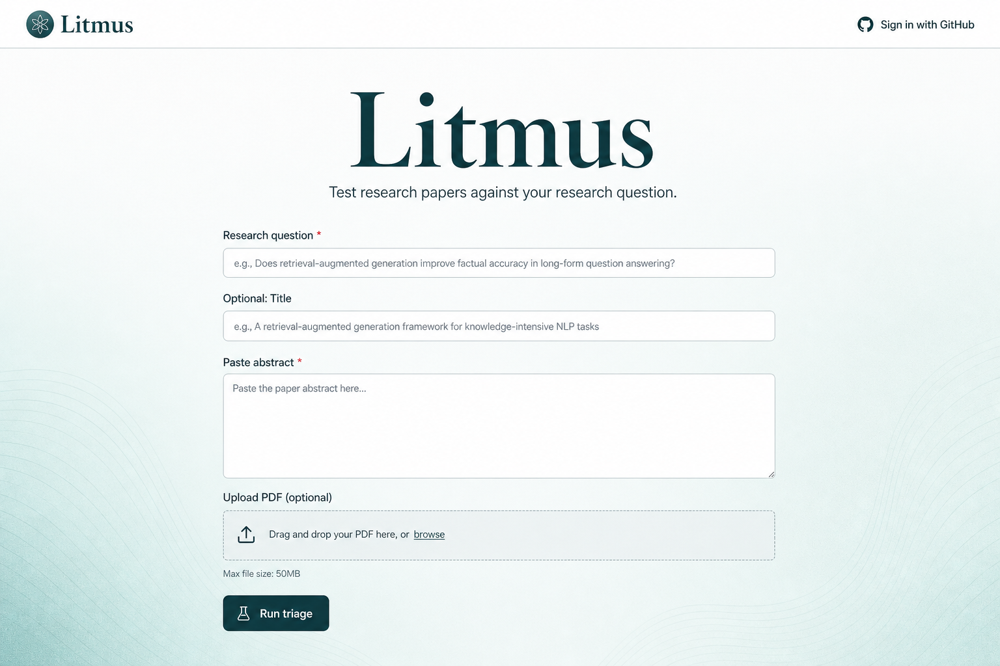
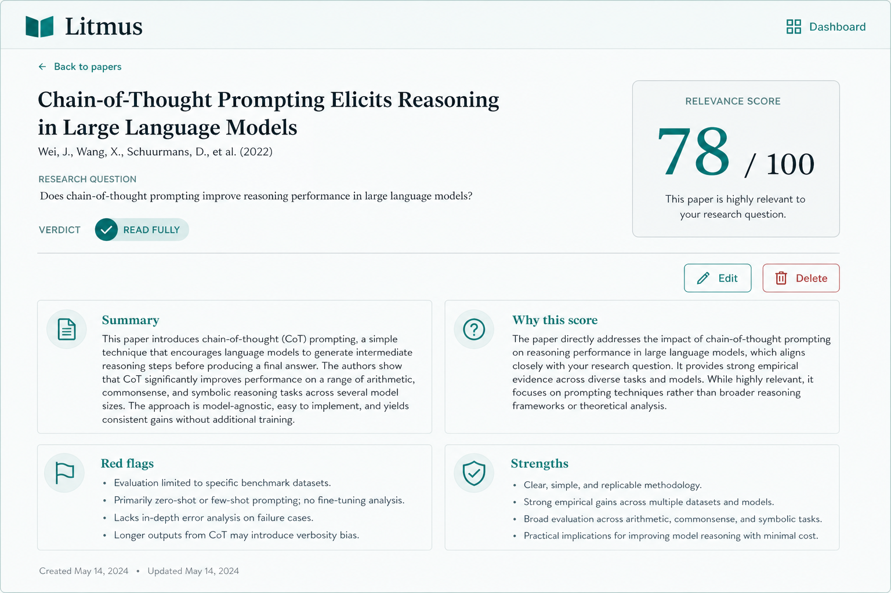
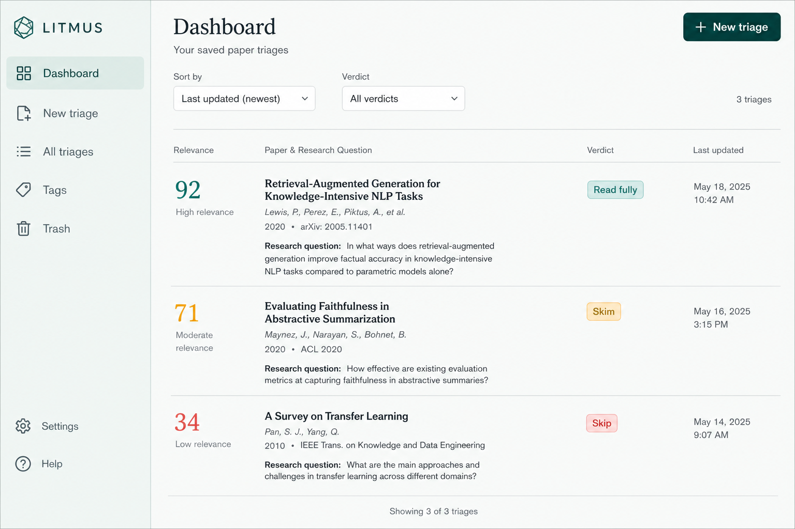

# Litmus — Research Paper Triage

## a. What it is

**Litmus** helps researchers decide whether a paper is worth a deep read. Paste an abstract (or upload a PDF), state your research question, and Litmus returns a structured critique: relevance score, methodological red flags, strengths, and a **read fully / skim / skip** verdict.

**Problem:** Literature review burns time on papers that look relevant from the title but aren’t aligned with your actual question—or that hide thin methods.  
**For whom:** Students, PhD candidates, and indie researchers doing a first-pass triage before committing hours to a PDF.

## b. Live URL

<!-- Replace with your Vercel production URL after deploy -->
**Live app:** [https://YOUR-PROJECT.vercel.app](https://YOUR-PROJECT.vercel.app)

## c. Features

- GitHub OAuth sign-in (Auth.js v5)
- Paste abstract/body text **or** upload a PDF
- Gemini 2.5 Flash structured critique (JSON)
- Relevance score 0–100 with justification
- Red flags & strengths lists (empty when none found)
- Verdict: read fully / skim / skip
- Save triages to Vercel Postgres via Prisma
- Dashboard sorted by relevance (or newest), filterable by verdict
- Edit title / research question / source URL; delete a triage
- Clear errors for unparseable/scanned PDFs, missing input, and Gemini rate limits
- Mobile-friendly layout

## d. The AI feature

Litmus sends the paper title, available text (capped at ~15k characters), and your research question to **Gemini 2.5 Flash** with this system prompt (verbatim):

```
You are a research paper triage assistant. Given a paper's title, abstract,
and available body text, and a user's stated research question, produce a
structured critique as JSON with exactly these fields:

- summary: 2-3 sentence plain-language summary of the paper's core claim
- relevance_score: integer 0-100, how relevant this paper is to the user's
  stated research question
- relevance_reason: 1-2 sentences justifying the score
- red_flags: array of strings, each a specific methodological concern
  (e.g. "sample size of 12 with no reported effect size", "no baseline
  comparison method", "metric choice inflates reported performance").
  Empty array if none found — do not invent flags to fill the list.
- strengths: array of strings, specific methodological strengths
- verdict: one of "read fully", "skim", "skip"

Base every claim only on the text provided. If the text is truncated or
insufficient to assess something (e.g. no methods section available), say
so explicitly rather than guessing. Do not fabricate citations, numbers,
or details not present in the input.

Respond with ONLY the JSON object, no markdown fences, no preamble.
```

**Critique fields explained**

| Field | Meaning |
| --- | --- |
| `summary` | Plain-language core claim of the paper |
| `relevance_score` | 0–100 fit to *your* research question (also stored for sorting) |
| `relevance_reason` | Short justification for the score |
| `red_flags` | Specific methodological concerns; may be `[]` |
| `strengths` | Specific methodological strengths |
| `verdict` | `read fully`, `skim`, or `skip` |

Input shape fed to the model: `{title}\n\n{abstract/body}\n\nResearch question: {question}`.

Scanned/image-only PDFs are **not** OCR’d: if text extraction is near-empty, Litmus shows an error instead of guessing.

## e. Tools & services

- **Next.js 14** (App Router)
- **Vercel** (hosting)
- **Gemini 2.5 Flash** via `@google/genai`
- **Auth.js v5** (NextAuth) — GitHub OAuth only
- **Prisma** + **Vercel Postgres** (Neon-backed)
- **pdf-parse** (server-side PDF text)
- **Tailwind CSS**
- Built with **Cursor / Claude Code**

## f. Screenshots







## g. How to run locally

1. **Clone**

```bash
git clone https://github.com/YOUR_USER/litmus.git
cd litmus
```

2. **Install**

```bash
npm install
```

3. **Env** — copy `.env.example` → `.env.local` and fill:

```
GEMINI_API_KEY=
AUTH_GITHUB_ID=
AUTH_GITHUB_SECRET=
AUTH_SECRET=
POSTGRES_PRISMA_URL=
POSTGRES_URL_NON_POOLING=
```

Generate `AUTH_SECRET` with `npx auth secret`.  
Create a GitHub OAuth App with callback `http://localhost:3000/api/auth/callback/github`.  
Attach Vercel Postgres (or any Neon Postgres) and paste the pooled + direct URLs.

4. **Migrate**

```bash
npx prisma migrate dev --name init
```

5. **Dev server**

```bash
npm run dev
```

Open [http://localhost:3000](http://localhost:3000).

### Deploy (Vercel)

1. Push the repo and import the project in Vercel.
2. Add the same env vars in the Vercel project settings.
3. Attach **Vercel Postgres** (sets `POSTGRES_PRISMA_URL` / `POSTGRES_URL_NON_POOLING`).
4. Add the production callback URL to your GitHub OAuth app: `https://YOUR-DOMAIN/api/auth/callback/github`.
5. Deploy; run migrations via `npx prisma migrate deploy` (or Vercel build with migrate) against production.

## Out of scope (v1)

Multi-provider auth, payments, OCR for scanned PDFs, realtime collaboration / sharing / teams.
